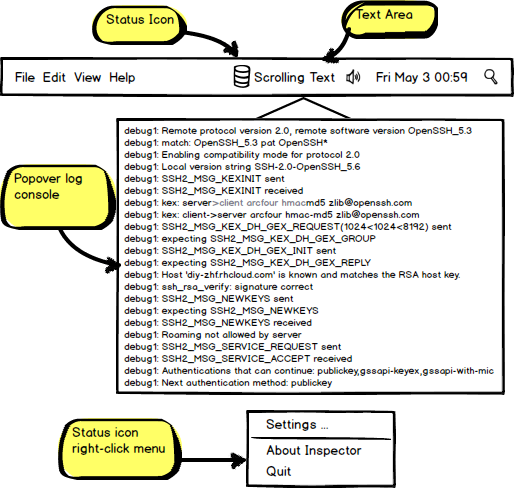

# Inspector Spec

Display the status of a service on the top menu bar (`NSStatusItem`) of OS X.

## Data Source

- Log of the service
- Result of a script (status code)

## Configuration 

### Folder Structure

A configuration for inspecting an service `sample.insp` is a folder that contains:

- A `config.json` for settings
- An image file for status `normal`
- An image file as the `error` icon when the check script fails
- One or more executable scripts or programs to run regularly. Returning status code `0` means normal, otherwise error

### Structure of configuration file

A configuration file is simply a JSON with some key-values:

- `icon-normal`, `icon-error` : images that represent the status of the service; both keys required
- `delay` : seconds since last inspection
- `script`, `command` : uri to script or commands to execute to get the status; Either `script` or `command` must exist
- `refresh-script` : if value is `true`, the script is re-downloaded upon every execution
- `log` : uri to get the log of the service

### Simple config files:

#### `my-web-server.insp/config.json`

```json
{
	"icon-normal": "normal.png",
	"icon-error": "error.png",
	"delay": "120",
	"script": "http://another-server/check-server.sh",
	"refresh-script": "true",
	"command": "",
	"log": "http://admin@my-server:8888/web.log"
}
```

#### `diggo.insp/config.json`

```json
{
	"icon-normal": "normal.png",
	"icon-error": "error.png",
	"delay": "30",
	"script": "",
	"command": "curl --socks5 127.0.0.1:1080 --head http://www.youtube.com/",
	"log": "/tmp/diggo.log"
}
```

## Launch

```
$ insp diggo.insp
```

## UI

### Elements

- Status icon
- Status text (hidden / fixed width)
- Popover console



### Statuses

#### `normal`

- Icon: `"normal"`
- Text: hidden

#### `getting-error`

- Icon: `"error"`
- Text: Last line of log
- Animation: Expanding text area and scrolling line

#### `error`

- Icon: `"error"`
- Text: Last line of log

#### `back-to-normal`

- Icon: `"normal"`
- Text: Last line of log
- Animation: Collapsing text area

### Log Console

- Left-click icon: Show / Hide
- Auto-scroll to make the latest line (bottom) visible

### Popup-menu

- Right-click icon: Trigger the popup-menu
- Settings: open a built-in text editor

## Future Development

- Add actions to popup-menu as service controls (start, restart, stop, ...)